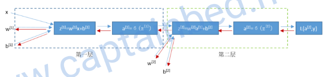
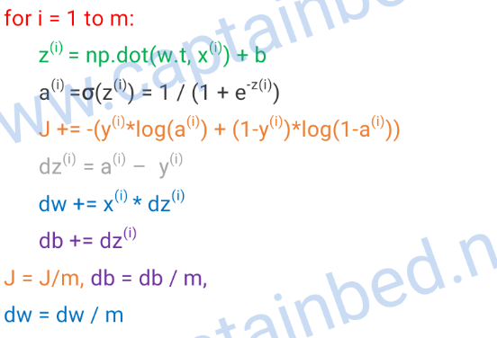
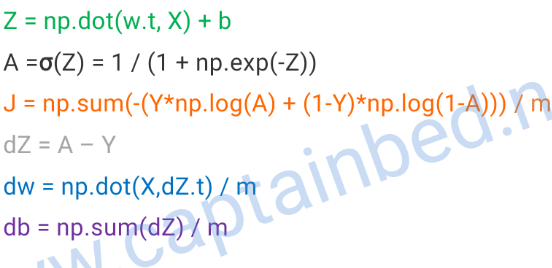

# 神经网络分类
## 类型
+ 监督学习
+ 非监督学习
## 结构
+ 标准神经网络SNN
+ 卷积神经网络CNN
+ 递归神经网络RNN 
+ 图神经网络GNN
## 数据
+ 结构化数据
+ 非结构化数据

# 网络预测
    神经网络的计算是由一个前向传播及一个反向传播构成，先通过前向传播计算出预测结果及损失，再通过反向传播计算出损失函数关于每一个参数的偏导数，并对这些参数进行梯度下降，然后使用新的参数进行新一轮的前向传播计算，如此来回不断训练更新参数使得损失函数越来越小预测越来越精确。
## 前向线性传播
### 初始化参数
    随机初始化权重矩阵 W 与偏置向量 b, 对于多神经元网络，W不能初始化成同样的值，通常使用随机数生成器生成W，如果使用sigmod激活函数，W最好尽量小以便一开始训练时的梯度较大，初始化参数后，基于 Wx+b 前向传播。
### 选择超参数
    学习率、网络层数、单层神经元个数、训练次数、每层的激活函数等

## 非线性激活函数
### sigmod：
映射范围：(0,1) ，适用分类输出层，公式及偏导数公式：
$$
f(x) = {1 \over 1 + e^{-x}}
\\
\frac{\partial f}{\partial x} = x(1-x) 
$$
### tanh：
映射范围（-1，1），容易将靠近0的输出值传递给下个神经元，缺点：输入数值较大时学习速率较慢（即梯度消失），公式及偏导数公式：
$$
f(x) = {e^x - e^{-x} \over e^x + e^{-x}}
\\
\frac{\partial f}{\partial x} = 1 - x^2
$$
### relu：
常用
$$
f(x) =
\left
\{
\begin{aligned}
0 && 当z < 0\\
x && 当z \geq 0
\end{aligned}
\right.
\\
\frac{\partial f}{\partial x} =
\left
\{
\begin{aligned}
0 && 当z < 0\\
1 && 当z \geq 0
\end{aligned}
\right.
\\
$$
### leaky relu：
解决relu中输入值小于0的情况
$$
f(x) =
\left
\{
\begin{aligned}
0.01x && 当z < 0\\
x && 当z \geq 0
\end{aligned}
\right.
\\
\frac{\partial f}{\partial x} =
\left
\{
\begin{aligned}
0.01 && 当z < 0\\
1 && 当z \geq 0
\end{aligned}
\right.
\\
$$

## 反向传播优化参数
    基于链式法则，计算损失函数 L 关于 W, b的偏导数(即参数优化方向，代入所有样本求平均)，再根据学习率和步长从后向前优化参数W, b

# 结果验证
## 损失函数
$$
    L(\hat{y}^{(i)},y^{(i)}) = {1 \over 2}(\hat{y}^{(i)} - y^{(i)})^2
    \\
    L(\hat{y}^{(i)},y^{(i)}) = -(y^{(i)}log(\hat{y}^{(i)}) + (1-y^{(i)})log(1-\hat{y}^{(i)}))
$$
# 网络优化器
## 凸函数
## 梯度下降算法

# python 编程技巧
## 向量化
    向量化可节约几百倍时间，有人解释是因为python每次循环调用都需要先将代码转换为c语言，循环次数多了，那每次转换消耗的总长就很大了，向量化操作是把一堆计算一次性转换成c语言，这样转换消耗只有一次。

 
 
